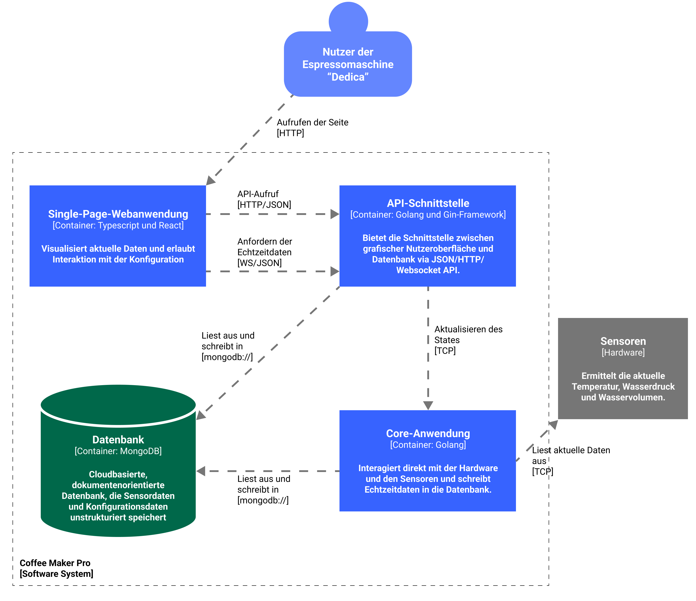
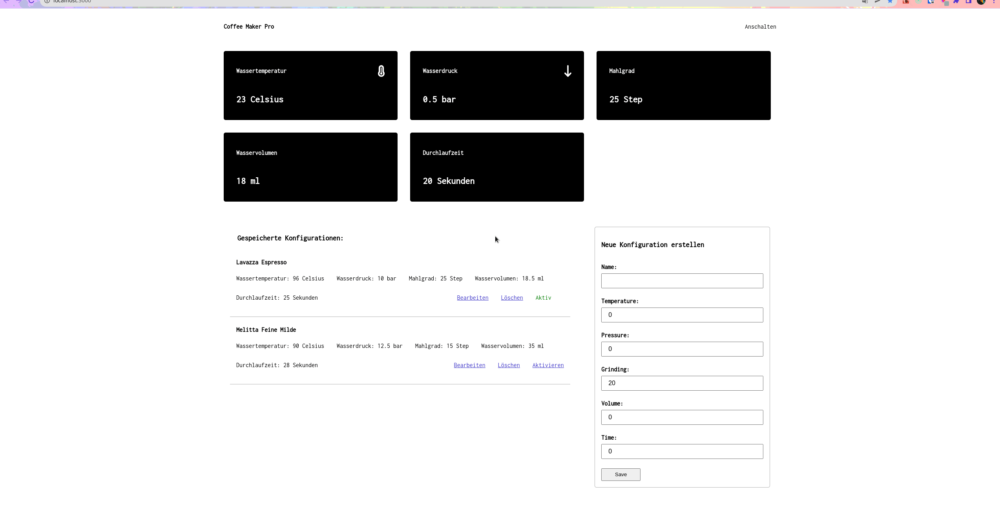

# README

# Coffee Maker Pro

This full stack application was written in the context of the bachelor’s thesis of the course of studies “Computer Media Science” at IU in 2022. The application provides a digital prototype of a portafilter coffee machine which is accessible via a web browser.

## Technologies

- Database: MongoDB in Docker image
- Core application: Golang 1.18
- API application: Golang 1.18
- Single page application: Node 16, React, Typescript, Redux Toolkit

## Initial setup

1. Create a log directory for the simulated sensor logs

```bash
mkdir -p /var/log/coffee-maker-pro
chmod 777 /var/log/coffee-maker-pro
```

2. Create the database instance with `docker` and `docker-compose` and setup the three replica sets. This enhances data redundancy and availability.

```bash
cd <project-root>
docker-compose up --build

# Initialize replica sets
docker ps # retrieve and copy the container id of the instance running on port 27011
docker exec -it <container-id> /bin/bash # enter the container
# Inside the container run following commands
mongo # Open mongo db server connection

# Initiate and prioritize the different replica instances inside of the docker network
rs.initiate(
	{
		_id: "rs0",
		members: [
			{ "_id": 0, "host": "localmongo1:27017, "priority": 4 },
			{ "_id": 1, "host": "localmongo2:27017, "priority": 2 },
			{ "_id": 2, "host": "localmongo3:27017, "priority": 1 }
		]
	}
);
```

3. Install the go binary and add it to your `PATH`. (In this project the version `1.18-beta` was used to make use of the new generic types feature.)

4. Fill in the database connection string of your create MongoDB instance. (`database.go`)

```go
// database.go
const USER = <database-username>
const PW = <database-password>
const HOST = <database-url>
const PORT = <database-port>
const DB = <database-name>
```

5. Build and start the `coffee-maker-pro` (Core app) and the `cmp-api` application (API app).

```bash
# navigate to commands directory
cd <project-root>/src/cmd
go build coffee-maker-pro.go
go build cmp-api.go

# navigate to bin directory within project
cd ../bin
./coffee-maker-pro
./cmp-api

```

6. Install all frontend dependencies

```bash
# navigate to web directory
cd <project-root>/src/web
npm install
```

7. Start single page application

```bash
cd <project-root>/src/web
npm start
```

8. Open a web browser and navigate to `http://localhost:3000`

## System Architecture



## User Interface


